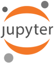

# Jupyter for Teaching and Learning
### A Workshop for STEM Faculty. 
**December 1–3, 2021, Washington, DC.**

> Twenty one months after the originally planned dates of 25–27 March 2020.
> We did not give up!

### Notices on COVID-19
[Oct. 16, 2021]
— From Sep. 27, GW requires that all visitors attest that they are vaccinated, or if they are unvaccinated, attest that they have received a negative COVID-19 test within 72 hours of their visit to campus.
Visitors will need to register at [go.gwu.edu/visitor](http://go.gwu.edu/visitor), complete a symptom screening form, and present their registration form to the campus host on arrival.
Masks are required indoors.

[March 11, 2020] 
—The workshop has been postponed.
Today, GW issued new guidance encouraging social distancing, including cancellation of gatherings at the university and the sharing of food and drink.
The WHO has declared COVID-19 a pandemic, and experts insist on social distancing as necessary measure.
Therefore, we cannot hold our workshop as planned.

## Description

**This workshop is for STEM faculty who want to transform their teaching through integrating computing in the content, process, and design of their courses.**

The presenters are instructors who have been using computing in their teaching for years, and are eager to share what we have learned. 
We also want to invite you to be part of a growing community of educators who discovered that modern tools, and new ways of collaborating, can supercharge teaching and learning. 

This is a sponsored workshop, and we are able to offer _full travel support_ (including lodging and food) for 20 or more participants. 
Our sponsor is **Leidos, Inc.**, with additional support from the National Science Foundation through a grant to Prof. Lorena A. Barba.

> [Enter your interest to participate and apply for travel funds](https://forms.gle/Azkzw8PiVu5LALWDA)

### What is "Engineers Code"?

**This workshop is open to any STEM faculty**, not just engineers.  We use the label _"Engineers Code"_ in a project that is developing open learning modules (see our [repository on GitHub](https://github.com/engineersCode/EngComp)), and the [#EngineersCode](https://twitter.com/hashtag/engineerscode?f=live) hashtag on Twitter for announcing newly released content, and inviting a community. 

## Details

### Time and Place

The workshop will be held over three days on 1–3 December 2021, at the [George Washington University](https://www.gwu.edu), in Washington, DC. 
We expect arrivals on Wednesday 12/01, for a start with light lunch and afternoon activities. We will finish early afternoon on Friday 12/03 for folks to travel back on that evening. 
If you are traveling from farther away, and need to stay an extra night, that is OK, too.

**Schedule:**

- Wednesday 12/01 12:30 (light lunch provided), 2–5 pm sessions, with break
- Thursday 12/02, 9:30 am to 5 pm
- Friday, 12/03, 9:30 am to 2:30 pm

**Hotel**: We have made a block booking at [ARC The Hotel DC](http://arcthehoteldc.com), 824 New Hampshire Ave NW, Washington, D.C. 20037. The hotel will bill us directly for your stay.

### Funding

Funding is available to cover all costs of 20 to 25 participants (depending on actual travel costs), including: airfare and ground travel, lodging in Washington, and all meals. 

### Who is this for?

This workshop is for faculty at any stage of their career, who are teaching in science, engineering, or related technical fields. 
The only pre-requisite is that you are still curious and eager to learn, and that you want to empower your students to be successful in this technology driven world of today. 
You do not need to be an experienced programmer, but you should have familiarity with technical computing.
We will use Python and Jupyter as the programming language and environment.

> See the [list of participants](https://engineerscode.github.io/facultydev1/participants) (as of 03/09/2020) — PENDING CONFIRMATION

### Organizers and presenters

- [Lorena A. Barba](https://lorenabarba.com) is a professor of mechanical and aerospace engineering at the George Washington University. Her research interests include computational fluid dynamics, biophysics, and high-performance computing.  Barba received a PhD in aeronautics from the California Institute of Technology. Contact her at [labarba@gwu.edu](labarba@gwu.edu).

- [Kyle Niemeyer](https://niemeyer-research-group.github.io) is an associate professor in the School of Mechanical, Industrial, and Manufacturing Engineering at Oregon State University. His research interests are in computational modeling for fluid mechanics, combustion and chemical kinetics, and related topics like numerical methods and parallel computing. Contact him at [kyle.niemeyer@oregonstate.edu](mailto:kyle.niemeyer@oregonstate.edu).
- [Bryan Weber](https://bryanwweber.com) is assistant professor in residence and director of undergraduate studies at the University of Connecticut department of mechanical engineering. His research interests are in combustion of biofuels, computational analysis of reaction mechanisms for combustion, and software tools for combustion research and thermodynamics. Contact him at [bryan@bryanwweber.com](mailto:bryan@bryanwweber.com).
- Guest speakers to be announced.

## Content Overview

### Coding to learn

For years now, we've been hearing calls for “learning to code.” These calls may be well-intentioned and worthwhile, but they miss the point—what we need is _coding to learn_. 
Computing can be a medium to express ideas, inferences, arguments, or commentaries about the physical world (and, indeed, about social worlds). 
A lot has been said about "computational thinking" and how it might be taught. We'll have conversations about what computational thinking really means, its historical background, and the implications for STEM education. 

> This portion of the workshop aims to inspire the rest of it by illustrating _"The Why"_ of our approach, philosophy, and methods to teach with computing.

### Teaching and Learning with Jupyter

[Jupyter](https://jupyter.org) is an open-source software project, including an ecosystem of tools for interactive computing. 
At the center of this ecosystem is the Jupyter Notebook, a file format that allows for the coexistence of regular text-based content, multi-media content, and computation with its live output. 
Since the prelude project, IPython Notebooks, STEM educators have found exciting opportunities to use computational notebooks to present technical materials for students to explore. 

Jupyter notebooks are at the center of a broad initiative to integrate [data science in the undergraduate curriculum](https://data.berkeley.edu/news/coursefuture) at the University of California Berkeley. 
There, and elsewhere, instructional teams began developing various tools to  support the teaching mission, such as auto-graders. 
Many educators and community trendsetters began sharing educational content written as Jupyter notebooks, and this trend spread through technical conferences and coding bootcamps. 

In this workshop, we will coach participants in the use of the full Jupyter ecosystem for teaching and learning, including best practices learned and shared by the pioneers. 
This includes Jupyter itself, extensions for auto-grading assignments using Jupyter, infrastructure solutions for computing in the cloud, and platforms for sharing content with students and the public. 

> This portion of the workshop will include a starter's tutorial on using Jupyter, and thus is adequate for the uninitiated. Some programming background is necessary, ideally in Python, but you don't have to be an expert. 

### Pedagogy of Open Education

When speaking about open education, most people think about open course-ware (OCW) or open educational resources (OER). 
Historically, the open-education movement was inspired by free and open-source software. 
This inspiration led to the drafting of standard public licenses for content, the Creative Commons licenses, and agreements on the [_open definition_](https://opendefinition.org):

> Open data and content can be freely used, modified, and shared by anyone for any purpose.

The predominant narratives about OER emphasize _content_, created to favor access, in an open model. 
But, unlike in open-source software, very little reuse occurs. 
This trend has missed important features of free and open-source software: open development, networked collaboration, community, and a value-based framework.

"Openness is about the possibilities of communicating with other people. It’s not about _stuff_, what you do with _stuff_. It’s about what you do with each other," said Stephen Downes in a short [video](https://youtu.be/FPHYAFcUziA) from 2017.


> This portion of the workshop will help you answer the question: _"Why open education?"_ It will introduce you to the open-source development model, and how open teaching and learning practices actively promote rich networks, lively communities, and fertile connections. That is the pedagogy of openness!

### Teach with our Jupyter notebooks

When teaching a new course or learning module, it's often hard to adopt materials developed by others. We end up re-inventing the wheel, and writing material from scratch, when perhaps some really good material has been shared by others. 
The presenters in this workshop have developed openly licensed material that is meant to be reused. We want to coach participants on how to teach using these (and other) publicly available materials, how to make a "fork" of the materials to adapt to your own use, and potentially contribute improvements or variations in an open model. 

### Write your own content with Jupyter

Developing original content using Jupyter is fun! We have learned many tricks that could be helpful to participants: how to use version control with Jupyter notebooks, how to collaborate with others, how to build lessons using good instructional design, and how to share the materials with students. 
We will give an introduction to using GitHub to organize your class materials, and to track the progress of your development using the project-management tools provided by GitHub.
We'll also discuss some of the tools we use to develop student assignments using Jupyter, particularly to get these assignments auto-graded.

### Other topics

- Writing student assignments using [`nbgrader`](https://nbgrader.readthedocs.io/en/stable/), the Jupyter extension for auto-grading notebooks via hidden tests.
- Other auto-grading tools.
- Using [GitHub Classroom](https://classroom.github.com) to collect student assignments for grading, and more.
- Turning your Jupyter notebooks into an online textbook with [JupyterBook](https://jupyterbook.org/intro.html).

### Guest presentations

#### Laura Wrubel

Laura is part of [GW Libraries and Academic Innovation](https://lai.gwu.edu), which has been experimenting several models to meet the demand for coding instruction at GW. 
They turned Prof. Barba's open curriculum, designed for teaching computational thinking foundations to first-year engineering students, into a three-day [Python Camp](https://libguides.gwu.edu/python-camp) open to everybody. 
Key components of the mini-course are:

- Using the [Carpentries](https://carpentries.org) pedagogical approach, they emphasize live-coding and formative assessment.  
- Taking advantage of the [Open edX platform’s integration with Jupyter notebooks](https://lorenabarba.com/news/jupyter-based-courses-in-open-edx-authoring-and-grading-with-notebooks/), auto-graded homework assignments, and the library-hosted JupyterHub platform. 
- Learners who complete course requirements receive a certificate of completion.

**Bio**:
Laura Wrubel is a software development librarian at GW. She supports software applications, is a [Carpentries](https://carpentries.org) instructor, and teaches workshops on Python, git, social media data, and computational topics for students, faculty, and library staff. 

#### Ryan Watkins

Ryan will present on major considerations as you design your courses to leverage technology. Key elements of his talk will include: 

- clarifying what skills students should develop and why, 
- getting to know your students and their study strategies,
- planning for how you will assess their knowledge & skills, and
- creating engaging and motivational activities. 

**Bio**:  [Ryan Watkins](www.ryanrwatkins.com) is a Professor of Educational Technology (MA) and Human-Technology Collaboration (PhD) at GW. He teaches instructional design, needs assessment, and research methods.  He is an author of 12 books, including Teaching and Learning with Jupyter, and more than 100 articles related to improving learner and organizational performance. He is co-host of [Parsing Science](www.parsingscience.org), a podcast about the stories behind today’s most compelling science. 
He also curates [We Share Science](www.wesharescience.com) and contributes to [SciencePods](www.sciencepods.com).

#### David Lippert

David will give a 30-min presentation, targeting:

- Why it matters to employers that we change teaching practices so all graduates are conversant with computational approaches to problem-solving, essentials of data science, and various modern tools of technology. 
- The room where it happens. The questions we ask in interviews and how we make the decision to hire entry level candidates

**Bio**: David Lippert is a software engineer at [Leidos](https://www.leidos.com) in Arlington, Virginia.  He uses Jupyter notebooks for prototyping, exploratory data analysis, evaluating machine learning algorithms, and sharing knowledge.  He is an advocate for inclusion, as leader of his office’s intern program and yearly participant at diversity recruitment events.

_Other guest talks to be announced._

## References and resources

- [Teaching and Learning with Jupyter](http://go.gwu.edu/jupyter4edu), an open book (2019). Lorena A. Barba, Lecia J. Barker, Douglas S. Blank, Jed Brown, Allen B. Downey, Timothy George, Lindsey J. Heagy, Kyle T. Mandli, Jason K. Moore, David Lippert, Kyle E. Niemeyer, Ryan R. Watkins, Richard H. West, Elizabeth Wickes, Carol Willing, and Michael Zinga
- Engineers Code: reusable open learning modules for engineering computations, Lorena A. Barba. _Computing in Science and Engineering_, [doi:10.1109/MCSE.2020.2976002](http://doi.org/10.1109/MCSE.2020.2976002)
- [How to use Git/GitHub with Jupyter Notebook](https://blog.reviewnb.com/github-jupyter-notebook/), a blog post by Amit Rathi
- Barba, Lorena A.; Talbert, Robert (2018): Flipped learning with Jupyter: Experiences, best practices, and supporting research. figshare. Presentation. [10.6084/m9.figshare.7001522.v2](https://doi.org/10.6084/m9.figshare.7001522.v2)
- Barba, Lorena A. (2017): Teaching in STEM Disciplines: Open Source Methods. figshare. Presentation. [10.6084/m9.figshare.5544457.v1](https://doi.org/10.6084/m9.figshare.5544457.v1)
- Weber, Bryan W. (2019): "Climbing Bloom's Taxonomy With Jupyter Notebooks: Experiences in Mechanical Engineering," in Volume 5: Engineering Education, Salt Lake City, Utah, USA, 2019, p. V005T07A022, doi: [10.1115/IMECE2019-10615](https://doi.org/10.1115/IMECE2019-10615). Preprint available: [10.31224/osf.io/cxema](https://doi.org/10.31224/osf.io/cxema)
- Wilson, Greg: ["Teaching Tech Togehter"](https://third-bit.com/2018/07/15/teaching-tech-together.html), an open book, July 15, 2018.

---

## Join us in Washington!

Take a [virtual tour](https://virtualtour.gwu.edu/virtual-tour-map#ctdl-UMAP_2019121051598) of the GW Foggy Bottom campus area.

## Thanks

This workshop is sponsored by **Leidos, Inc**. Additional support by the National Science Foundation, through award 1730170 to Prof. Lorena A. Barba at the George Washington University.

## Credit

This website is based on Aidan Feldman's [Advanced JavaScript class](https://advanced-js.github.io/syllabus/).
